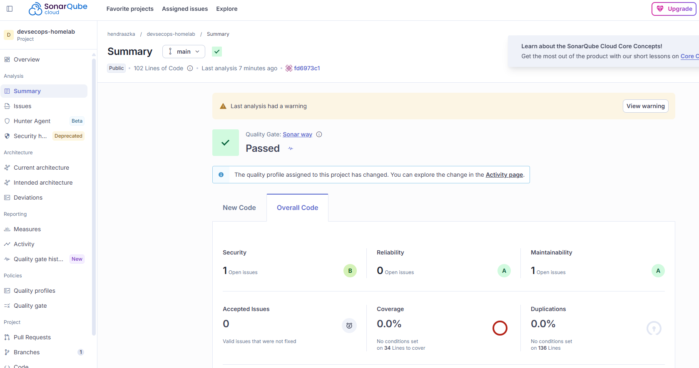
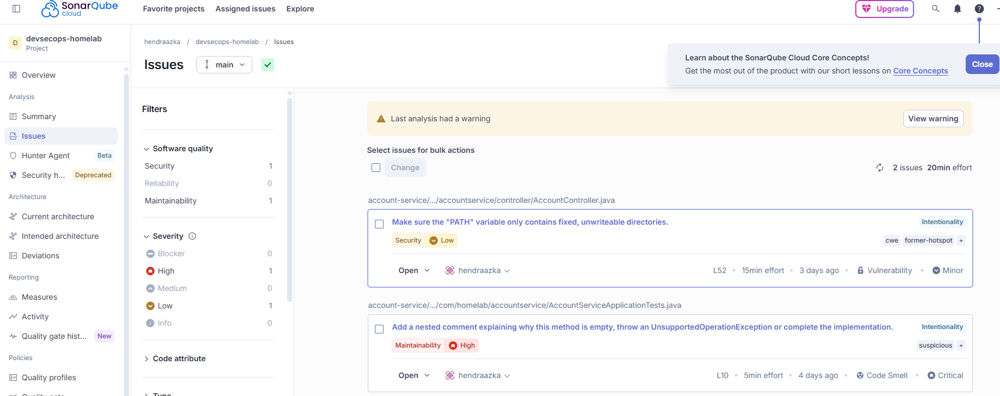
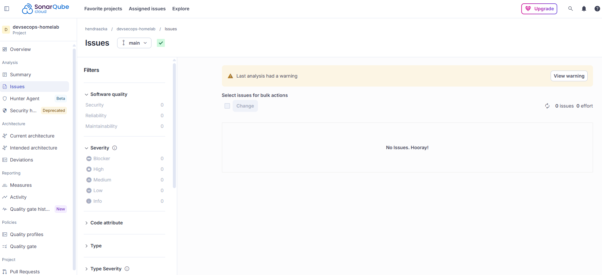
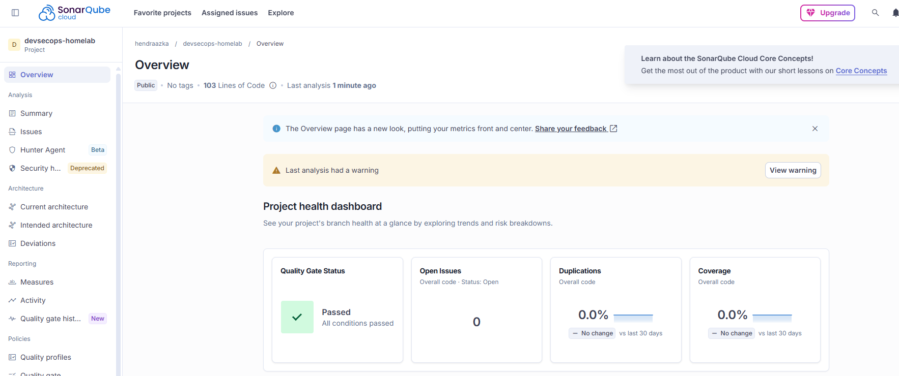

# Day 15 — SonarQube: SAST & Code Quality (Pembanding Semgrep)

[⬅️ Day 14](../day-14-iac-security-scanning/notes.md) | [⬅️ Kembali ke index](../README.md) | [➡️ Day 16](../day-16-jenkins-migration/notes.md)

---

## ✅ Yang Dipelajari

- [x] Bedanya SonarQube dengan Semgrep — dashboard-driven, cakupan lebih luas dari sekadar security
- [x] 5 pilar SonarQube: Security, Reliability, Maintainability, Coverage, Duplications
- [x] Konsep **Quality Gate** — aturan pass/fail yang bisa dikustomisasi, mirip Constraint di Gatekeeper (Day 13)
- [x] SonarCloud vs SonarQube self-hosted — keputusan arsitektur terkait keterbatasan jaringan (Day 10)
- [x] Automatic Analysis vs CI-based Analysis — perbedaan cara kerja dan kenapa pilih CI-based
- [x] GitHub Secret untuk credential eksternal (`SONAR_TOKEN`)
- [x] `sonar-project.properties` — konfigurasi project key, organization, source path
- [x] 2 SAST tools (Semgrep, SonarQube) saling melengkapi — menangkap sudut berbeda dari kode yang sama

---

## 🧠 Konsep Kunci

| Istilah | Analogi | Penjelasan |
|---|---|---|
| **SonarQube** | General check-up dokter | Mengukur kesehatan kode secara menyeluruh: security, bug, code smell, test coverage, duplikasi — bukan cuma security seperti Semgrep |
| **Quality Gate** | Standar kelulusan ujian | Aturan pass/fail yang bisa dikustomisasi (misal "coverage > 80%"), mirip Constraint Gatekeeper tapi untuk kualitas kode |
| **Automatic Analysis** | Dokter keliling tanpa jadwal | SonarCloud sendiri yang scan repo secara berkala, tidak terintegrasi dengan pipeline CI |
| **CI-based Analysis** | Check-up terjadwal, bagian dari rutinitas | Scan dijalankan dari dalam `ci.yml`, sejalan dengan job-job lain, hasilnya konsisten dengan kapan kode di-push |
| **Security Hotspot vs Vulnerability** | Titik rawan vs luka nyata | SonarQube membedakan kode yang "berpotensi" rawan (perlu direview manual) dengan yang sudah pasti jadi vulnerability |

**Kenapa perlu 2 SAST tools (Semgrep dan SonarQube)?**
Terbukti nyata di hari ini — SonarQube menemukan isu PATH environment variable di endpoint yang **sama** dengan yang sudah "diperbaiki" Semgrep (Day 07), tapi dari **sudut pandang berbeda**. Semgrep fokus ke aliran data (tainted input ke command eksekusi), SonarQube fokus ke konfigurasi environment saat eksekusi command. Satu tool tidak otomatis menangkap semua kemungkinan masalah.

---

## 💻 Langkah 1 — Setup SonarCloud

1. Daftar di `sonarcloud.io`, login dengan GitHub
2. Organisasi otomatis dibuat dari akun GitHub (`hendraazka`, Free plan)
3. Tambah project baru, pilih repo `devsecops-homelab`
4. **Matikan "Automatic Analysis"** dulu — SonarCloud tidak mengizinkan 2 mode analisis aktif bersamaan
5. Setup **"CI-based Analysis (GitHub Action)"** — generate token untuk autentikasi dari CI

**Insight:** Automatic Analysis cocok untuk quick-look tanpa setup, tapi tidak terintegrasi ke pipeline. Untuk konsistensi dengan 6 job lain yang sudah dibangun sejak Day 02, CI-based Analysis adalah pilihan yang tepat.

---

## 💻 Langkah 2 — Simpan Token sebagai GitHub Secret

1. Copy token dari wizard SonarCloud
2. GitHub repo → Settings → Secrets and variables → Actions → New repository secret
3. Name: `SONAR_TOKEN`, Secret: (token dari SonarCloud)

**Insight:** konsisten dengan prinsip Gitleaks (Day 06) — credential tidak pernah ditulis langsung di file YAML, selalu lewat GitHub Secrets.

---

## 💻 Langkah 3 — Konfigurasi Project

`sonar-project.properties`:
```properties
sonar.projectKey=hendraazka_devsecops-homelab
sonar.organization=hendraazka
sonar.sources=account-service/src
sonar.java.binaries=account-service/target/classes
```

**Insight:** `sonar.sources` diarahkan khusus ke `account-service/src` (bukan seluruh repo) supaya analisis fokus ke kode aplikasi, tidak tercampur dengan `terraform/`, `k8s/`, dll. `sonar.java.binaries` diperlukan karena SonarQube untuk Java butuh hasil compile (`.class`), bukan cuma baca source `.java` langsung seperti Semgrep.

---

## 💻 Langkah 4 — Tambahkan Job `sonarqube-scan` ke CI

```yaml
  sonarqube-scan:
    runs-on: ubuntu-latest
    steps:
      - name: Checkout kode
        uses: actions/checkout@v4
        with:
          fetch-depth: 0

      - name: Setup Java 17
        uses: actions/setup-java@v4
        with:
          java-version: '17'
          distribution: 'temurin'
          cache: 'maven'

      - name: Compile untuk hasil binaries
        run: mvn -B clean compile
        working-directory: ./account-service

      - name: SonarQube Cloud Scan
        uses: SonarSource/sonarqube-scan-action@v4
        env:
          SONAR_TOKEN: ${{ secrets.SONAR_TOKEN }}
```

**Insight:** `fetch-depth: 0` diperlukan sama seperti Gitleaks — SonarQube butuh history Git lengkap untuk analisis blame/ownership. Step compile ditambahkan karena kebutuhan `sonar.java.binaries`.

---

## 🔧 Troubleshooting

### Masalah 1 — File `sonar-project.properties` tidak ter-commit

```
ERROR You must define the following mandatory properties for 'Unknown':
sonar.projectKey, sonar.organization
```

**Penyebab:** file sempat dibuat secara lokal tapi tidak pernah benar-benar tersimpan — kemungkinan command heredoc tidak sempat dijalankan sendiri di antara banyak langkah berurutan. Dikonfirmasi dengan `git show <commit> --stat` yang menunjukkan commit hanya berisi perubahan `ci.yml`, tanpa file properties.

**Solusi:** buat ulang file, verifikasi keberadaannya dengan `ls -la` sebelum commit, baru push.

### Masalah 2 (bukan blocking) — Warning versi action

```
Warning: This version of the SonarQube Scanner GitHub Action is no longer
supported and contains a security vulnerability. Please update to
sonarsource/sonarqube-scan-action@v6
```

**Catatan:** ini warning, bukan error — scan tetap berjalan sukses. Dicatat sebagai item follow-up untuk upgrade versi action di masa depan, tapi tidak menghalangi fungsi saat ini.

---

## 🔬 Hasil Scan Pertama

Dashboard: `https://sonarcloud.io/dashboard?id=hendraazka_devsecops-homelab`

| Metrik | Hasil |
|---|---|
| Quality Gate | ✅ Passed |
| Security | 1 open issue (rating B) |
| Reliability | 0 issues (rating A) |
| Maintainability | 1 open issue (rating A) |
| Coverage | 0.0% |
| Duplications | 0.0% |



### Temuan 1 — Security (Low): PATH variable di `AccountController.java` L52

> "Make sure the PATH variable only contains fixed, unwritable directories."

Terkait endpoint `ping/{host}` yang sudah diperbaiki dengan `ProcessBuilder` di Day 07 — tapi SonarQube menyoroti sudut berbeda: environment variable `PATH` yang dipakai mencari executable `ping` berpotensi dimanipulasi kalau tidak dikunci eksplisit.

### Temuan 2 — Maintainability (High): Method test kosong di `AccountServiceApplicationTests.java` L10

> "Add a nested comment explaining why this method is empty, throw an UnsupportedOperationException or complete the implementation."

Method `contextLoads()` yang sengaja kosong sejak Day 01 (smoke test) dianggap code smell tanpa penjelasan eksplisit.



---

## 💻 Langkah 5 — Perbaikan

**Perbaikan 1 — kunci PATH untuk ProcessBuilder:**
```java
ProcessBuilder pb = new ProcessBuilder("/bin/ping", "-c", "1", host);
pb.environment().put("PATH", "/usr/bin:/bin");
pb.start();
```

**Insight:** path absolut (`/bin/ping`) menghilangkan ketergantungan pencarian lewat `PATH`; baris `environment().put(...)` sebagai lapisan tambahan mengunci `PATH` ke direktori sistem standar yang tidak bisa ditulis sembarang user.

**Perbaikan 2 — dokumentasikan method test kosong:**
```java
@Test
void contextLoads() {
    // Sengaja kosong: smoke test ini memverifikasi bahwa seluruh
    // Spring application context bisa start tanpa error konfigurasi.
    // Kegagalan startup akan membuat test ini gagal secara otomatis
    // tanpa perlu assertion eksplisit.
}
```

---

## 🔬 Hasil Setelah Perbaikan

```
Security: 0 open issues
Reliability: 0 open issues
Maintainability: 0 open issues
"No Issues. Hooray!"
```

Quality Gate tetap **Passed**, semua kategori bersih total.





---

## 📌 Insight Penting

- **SonarQube dan Semgrep saling melengkapi**, bukan redundan — terbukti nyata dengan temuan PATH variable yang tidak tertangkap Semgrep meski di area kode yang sama.
- **Automatic vs CI-based Analysis** adalah keputusan arsitektur penting — CI-based lebih konsisten dengan alur kerja tim (hasil selalu terkait dengan commit spesifik), sementara Automatic lebih cocok untuk eksplorasi cepat tanpa setup.
- **Selalu verifikasi file benar-benar tersimpan** sebelum commit — kejadian `sonar-project.properties` yang sempat "hilang" adalah pengingat penting untuk selalu `ls -la` atau `cat` sebelum `git add`, bukan berasumsi command sebelumnya pasti berhasil.
- **Coverage 0.0% adalah data jujur**, bukan kegagalan — project ini memang belum punya unit test yang menguji logic bisnis, cuma smoke test. Ini catatan valid untuk perbaikan masa depan (di luar 12 hari roadmap utama).
- Dashboard SonarCloud bersifat **live**, tidak bisa "dipush" sebagai file ke Git — dokumentasi yang tepat adalah mencatat hasil, keputusan, dan link ke dashboard publik, sama seperti pola dokumentasi run GitHub Actions sepanjang journey ini.

---

[⬅️ Day 14](../day-14-iac-security-scanning/notes.md) | [⬅️ Kembali ke index](../README.md) | [➡️ Day 16](../day-16-jenkins-migration/notes.md)
