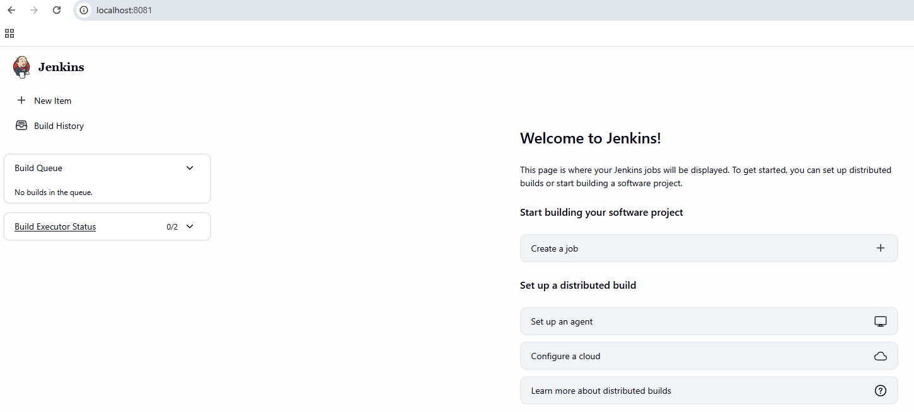
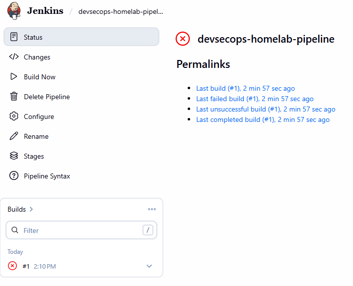
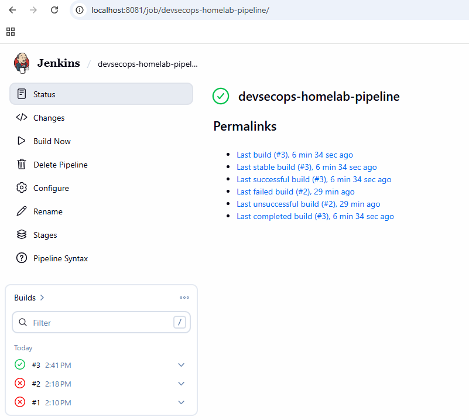
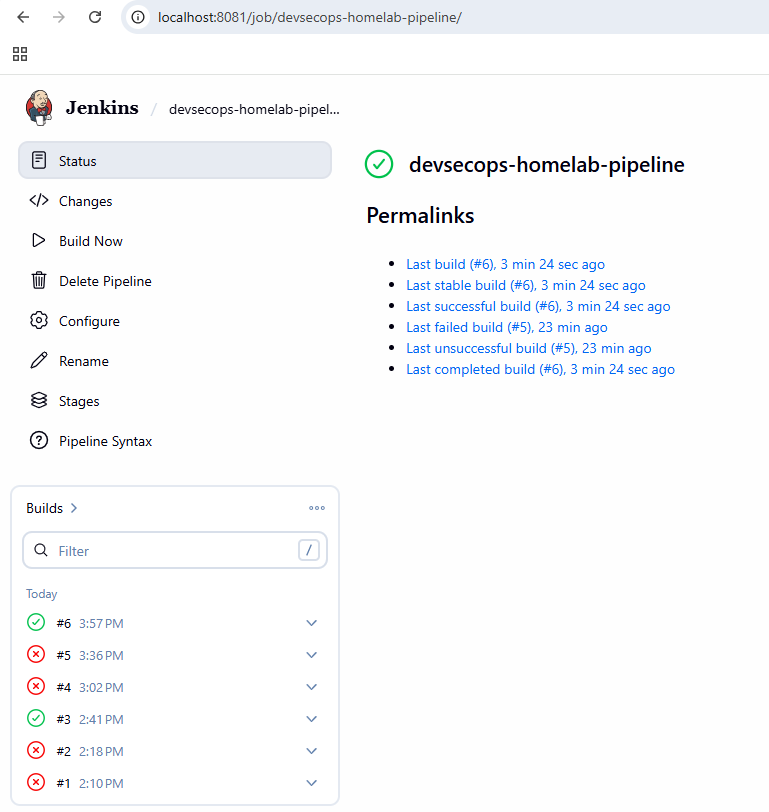

# Day 16 — Jenkins: Migrasi Pipeline & Solusi Continuous Deployment

[⬅️ Day 15](../day-15-sonarqube-sast/notes.md) | [⬅️ Kembali ke index](../README.md) | [➡️ Day 17](../day-17-ansible-provisioning/notes.md)

---

## ✅ Yang Dipelajari

- [x] Kenapa Jenkins lokal bisa menutup celah Continuous Deployment yang tidak bisa dilakukan GitHub Actions (cloud)
- [x] Install Jenkins via Docker, setup awal, plugin tambahan
- [x] Menghubungkan Jenkins ke cluster kind lewat Docker network internal (bukan `127.0.0.1`)
- [x] Jenkins Credentials — menyimpan kubeconfig sebagai Secret file
- [x] `Jenkinsfile` — pipeline as code versi Jenkins (Groovy), setara `ci.yml`/`cd.yml`
- [x] Container Jenkins itu "kosong" — perlu install manual: Maven, Docker CLI, kubectl, kind
- [x] Docker socket permission — GID harus dicocokkan persis antara host dan container
- [x] `kind load docker-image` — cara memindahkan image lokal ke node kind
- [x] Konflik `imagePullPolicy: Always` (dari Day 11) dengan image lokal yang tidak ada di registry manapun
- [x] Pembuktian nyata: **Continuous Deployment sungguhan** — image baru otomatis ter-deploy tanpa `kubectl apply` manual

---

## 🧠 Konsep Kunci

| Istilah | Analogi | Penjelasan |
|---|---|---|
| **Jenkins lokal vs GitHub Actions cloud** | Tetangga sebelah rumah vs kurir dari kota lain | Jenkins jalan di jaringan yang sama dengan cluster kind — bisa langsung `kubectl apply`, sesuatu yang mustahil untuk runner cloud |
| **Docker socket (`/var/run/docker.sock`)** | Kunci akses ke dapur pusat | Memberi container Jenkins kemampuan memerintah Docker engine host, bukan Docker terpisah di dalam container |
| **GID matching** | Kartu akses dengan nomor identik | Permission Linux dicek berdasarkan angka (GID), bukan nama grup — grup `docker` di container harus punya GID sama persis dengan di host |
| **`kind load docker-image`** | Titip barang ke gudang tetangga | Memindahkan image dari Docker engine host ke "dunia containerd" internal node kind, yang terpisah meski berjalan di atas Docker yang sama |
| **`imagePullPolicy: IfNotPresent` vs `Always`** | Cek stok lokal dulu vs selalu pesan baru | `Always` cocok untuk image dari registry (GitHub Actions); `IfNotPresent` diperlukan untuk image lokal yang tidak pernah di-push ke registry manapun |

**Kenapa Jenkins bisa menyelesaikan masalah yang GitHub Actions tidak bisa?**
Bukan soal Jenkins "lebih canggih" — murni soal **topologi jaringan**. GitHub Actions adalah komputer di cloud milik GitHub, sama sekali tidak terhubung ke jaringan lokal laptop. Jenkins yang dijalankan sebagai container Docker di laptop sendiri otomatis berada di jaringan yang sama dengan cluster kind, sehingga komunikasi langsung menjadi mungkin.

---

## 💻 Langkah 1 — Install Jenkins via Docker

```bash
docker volume create jenkins_home

docker run -d --name jenkins \
  -p 8081:8080 -p 50000:50000 \
  -v jenkins_home:/var/jenkins_home \
  -v /var/run/docker.sock:/var/run/docker.sock \
  --restart unless-stopped \
  jenkins/jenkins:lts
```

**Insight:** port `8081` dipakai (bukan `8080`) untuk menghindari bentrok dengan `account-service` yang memakai port sama lewat port-forward. Volume `jenkins_home` memastikan data Jenkins (job, plugin, config) tidak hilang meski container di-restart.

Setup awal: akses `http://localhost:8081`, masukkan initial admin password dari `docker logs jenkins`, install suggested plugins, buat user admin baru.



---

## 💻 Langkah 2 — Menghubungkan Jenkins ke Cluster kind

### Masalah: `127.0.0.1` tidak valid dari dalam container Jenkins

Kubeconfig WSL menunjuk ke `https://127.0.0.1:<port>` — alamat ini hanya valid dari WSL, bukan dari dalam container Jenkins yang terpisah.

### Solusi: gabungkan network, pakai IP internal Docker

```bash
docker network connect kind jenkins
docker network inspect kind | grep -A 3 "devsecops-homelab-control-plane"
# IPv4Address: 172.19.0.2/16

docker cp ~/.kube/config jenkins:/tmp/kubeconfig-original
docker exec -u root jenkins bash -c "sed 's|https://127.0.0.1:39979|https://172.19.0.2:6443|' /tmp/kubeconfig-original > /var/jenkins_home/.kube-config"

docker exec jenkins kubectl --kubeconfig=/var/jenkins_home/.kube-config get nodes
# devsecops-homelab-control-plane   Ready   control-plane
```

**Insight:** cluster kind dan Jenkins sama-sama container Docker — begitu digabungkan ke network `kind` yang sama, mereka bisa saling akses lewat IP internal Docker (`172.19.0.2:6443`), melewati batasan `127.0.0.1` yang cuma valid per-host.

### Simpan sebagai Jenkins Credential

```bash
docker cp jenkins:/var/jenkins_home/.kube-config ~/jenkins-kubeconfig
```

Manage Jenkins → Credentials → Add Credentials → Kind: Secret file → ID: `kubeconfig-devsecops-homelab`.

---

## 💻 Langkah 3 — Jenkinsfile (Pipeline as Code)

```groovy
pipeline {
    agent any
    environment {
        IMAGE_NAME = "account-service-jenkins"
    }
    stages {
        stage('Checkout') {
            steps { checkout scm }
        }
        stage('Build & Test') {
            steps {
                dir('account-service') {
                    sh 'mvn -B clean compile'
                    sh 'mvn -B test'
                }
            }
        }
        stage('Build Docker Image') {
            steps {
                dir('account-service') {
                    sh "docker build -t ${IMAGE_NAME}:${BUILD_NUMBER} ."
                    sh "kind load docker-image ${IMAGE_NAME}:${BUILD_NUMBER} --name devsecops-homelab"
                }
            }
        }
        stage('Deploy to Kubernetes') {
            steps {
                withCredentials([file(credentialsId: 'kubeconfig-devsecops-homelab', variable: 'KUBECONFIG_FILE')]) {
                    sh '''
                        kubectl --kubeconfig=$KUBECONFIG_FILE patch deployment account-service -p '{"spec":{"template":{"spec":{"containers":[{"name":"account-service","imagePullPolicy":"IfNotPresent"}]}}}}'
                        kubectl --kubeconfig=$KUBECONFIG_FILE set image deployment/account-service account-service=${IMAGE_NAME}:${BUILD_NUMBER}
                        kubectl --kubeconfig=$KUBECONFIG_FILE rollout status deployment/account-service
                    '''
                }
            }
        }
    }
    post {
        success { echo 'Pipeline Jenkins berhasil - deploy otomatis ke cluster selesai!' }
        failure { echo 'Pipeline Jenkins gagal - cek log di atas untuk detail.' }
    }
}
```

Jenkins job dikonfigurasi sebagai **"Pipeline script from SCM"** — selalu ambil `Jenkinsfile` terbaru dari repo, konsisten dengan prinsip "pipeline as code" seperti `ci.yml`/`cd.yml`.

---

## 🔧 Perjalanan Troubleshooting — 5 Masalah Berurutan (Build #1 sampai #6)

### Build #1 — `mvn: not found`



**Penyebab:** container Jenkins adalah image dasar, tidak dilengkapi tools build apapun.

**Solusi:**
```bash
docker exec -u root jenkins bash -c "apt-get update && apt-get install -y maven"
```

### Build #2 — `docker: not found`

**Penyebab:** mount `/var/run/docker.sock` cuma memberi akses ke Docker *engine*, tidak menyertakan Docker CLI (`docker` command) di dalam container.

**Solusi:**
```bash
docker exec -u root jenkins bash -c "apt-get update && apt-get install -y docker.io"
```

### Masalah tambahan — `permission denied` akses Docker socket

**Penyebab:** user `jenkins` di dalam container tidak tergabung di grup yang punya izin akses socket Docker; bahkan setelah dibuat grup `docker`, GID-nya berbeda dari GID asli socket di host (`1001`).

**Solusi:**
```bash
stat -c '%g' /var/run/docker.sock   # 1001
docker exec -u root jenkins bash -c "groupmod -g 1001 docker && usermod -aG docker jenkins"
docker restart jenkins
```

**Insight:** Linux mencocokkan **angka GID**, bukan nama grup — nama grup boleh sama di kedua sisi, tapi kalau angkanya beda, permission tetap ditolak.

### Build #3 — Sukses pertama (tapi belum benar-benar deploy image baru)



**Temuan tersembunyi:** pipeline hijau, tapi verifikasi manual menunjukkan deployment **masih memakai image lama** dari ghcr.io — `kubectl apply -f k8s/deployment.yaml` cuma re-apply manifest yang isinya tidak berubah, image baru yang dibuild Jenkins tidak pernah benar-benar dipakai.

**Solusi:** ganti ke `kubectl set image`, memaksa update image container secara eksplisit.

### Build #4-5 — `ImagePullBackOff`

**Penyebab 1 (Build #4):** image dibuild ke Docker engine host, tapi node kind punya "dunia containerd" internal terpisah — image tidak otomatis terlihat oleh kubelet di dalam node.

**Solusi:**
```bash
kind load docker-image account-service-jenkins:N --name devsecops-homelab
```
Ditambahkan sebagai step di stage "Build Docker Image".

**Penyebab 2 (Build #5):** meski sudah `kind load`, `imagePullPolicy: Always` (diset sejak Day 11 untuk workflow GitHub Actions) memaksa kubelet selalu mencoba pull ulang dari registry — gagal karena image lokal tidak pernah ter-push ke registry manapun (`pull access denied`).

**Solusi:**
```groovy
kubectl patch deployment account-service -p '{"spec":{"template":{"spec":{"containers":[{"name":"account-service","imagePullPolicy":"IfNotPresent"}]}}}}'
```

### Build #6 — Sukses Total, Terverifikasi



```bash
kubectl get deployment account-service -o jsonpath='{.spec.template.spec.containers[0].image}'
# account-service-jenkins:6
```

**Pembuktian final:** deployment benar-benar memakai image `account-service-jenkins:6` — image yang dibuild, dimuat ke node, dan di-deploy sepenuhnya oleh Jenkins tanpa intervensi manual apapun.

---

## 🔧 Ringkasan Troubleshooting

| # | Masalah | Penyebab | Solusi |
|---|---|---|---|
| 1 | `mvn: not found` | Container Jenkins tidak punya Maven/JDK | Install via `apt-get install maven` |
| 2 | `docker: not found` | Docker socket ter-mount, tapi CLI tidak ada | Install via `apt-get install docker.io` |
| 3 | `permission denied` ke Docker socket | GID grup `docker` di container ≠ GID socket di host | `groupmod -g <GID-host> docker`, restart container |
| 4 | Deploy "sukses" tapi image tidak berubah | `kubectl apply` cuma re-apply manifest lama | Ganti ke `kubectl set image` |
| 5 | `ImagePullBackOff` (percobaan 1) | Image lokal tidak terlihat oleh containerd node kind | `kind load docker-image` |
| 6 | `ImagePullBackOff` (percobaan 2) | `imagePullPolicy: Always` memaksa pull dari registry yang tidak ada | `kubectl patch` set `imagePullPolicy: IfNotPresent` |

---

## 📌 Insight Penting

- **Jenkins self-hosted secara topologi mampu melakukan sesuatu yang GitHub Actions cloud tidak bisa** — akses langsung ke infrastruktur lokal (Docker engine, cluster kind) — ini bukan soal salah satu tool "lebih baik", tapi soal use case yang berbeda.
- **Container "kosong" butuh dilengkapi manual** — beda dengan GitHub Actions runner yang sudah pre-installed banyak tools, Jenkins container base image cuma berisi Jenkins itu sendiri.
- **Permission Linux berbasis angka, bukan nama** — pelajaran GID matching ini berlaku luas di luar Docker, penting dipahami untuk debugging masalah permission di sistem apapun.
- **"Pipeline sukses" tidak selalu berarti "melakukan yang diharapkan"** — Build #3 hijau tapi ternyata tidak benar-benar deploy image baru; selalu verifikasi hasil akhir secara independen (bukan cuma percaya status pipeline), pola yang konsisten kita pegang sejak Day 14.
- **Keputusan desain di satu hari bisa berkonflik dengan keputusan di hari lain** — `imagePullPolicy: Always` yang benar untuk konteks Day 11 (GitHub Actions + registry) ternyata jadi penghalang untuk konteks Day 16 (Jenkins + image lokal). Solusinya bukan mengubah keputusan lama, tapi override kondisional sesuai konteks deployment.
- **kind cluster punya batas "dunia Docker" sendiri** meski berjalan di atas Docker Desktop yang sama — `kind load docker-image` adalah jembatan resmi yang disediakan untuk kasus image lokal seperti ini.

---

[⬅️ Day 15](../day-15-sonarqube-sast/notes.md) | [⬅️ Kembali ke index](../README.md) | [➡️ Day 17](../day-17-ansible-provisioning/notes.md)
