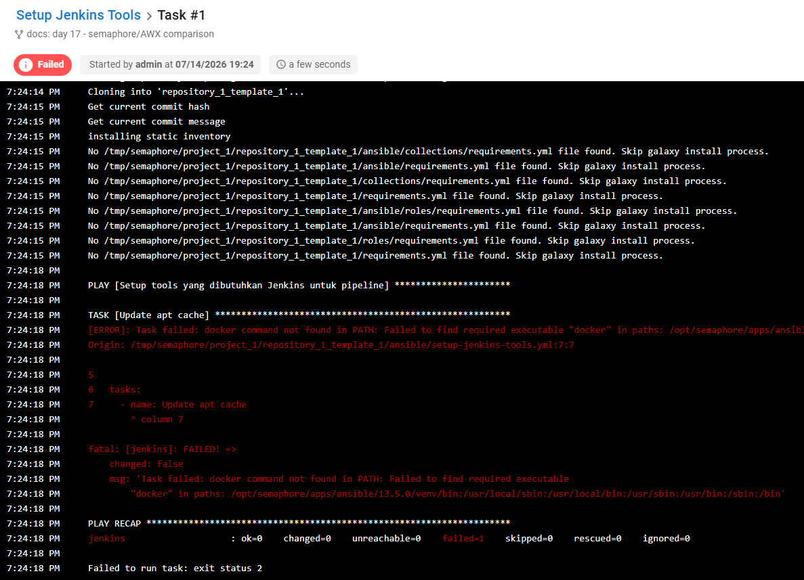
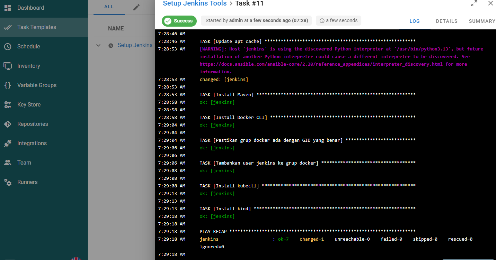

# Day 18 — Semaphore: GUI Ringan untuk Ansible

[⬅️ Day 17](../day-17-ansible-provisioning/notes.md) | [⬅️ Kembali ke index](../README.md) | [➡️ Day 19](../day-19-argocd-gitops/notes.md)

---

## ✅ Yang Dipelajari

- [x] Semaphore sebagai lapisan GUI di atas playbook Ansible yang sudah ada (bukan pengganti)
- [x] Struktur project Semaphore: Key Store, Repository, Inventory, Task Template
- [x] Perbedaan `SEMAPHORE_DB_DIALECT` (bolt vs sqlite) sebagai penyebab semu — akar masalah sesungguhnya adalah volume yang tidak bersih
- [x] Container yang menjalankan Ansible (Semaphore) butuh tools yang sama seperti target-nya butuhkan (Docker CLI, GID matching) — pola identik dengan Day 16
- [x] **Volume mount yang tidak lengkap** menyebabkan data hilang setiap restart — pelajaran krusial soal container stateful
- [x] `ansible_remote_tmp` untuk mengatasi resolusi `HOME` yang gagal lewat koneksi Docker
- [x] Pentingnya cek kondisi paling dasar (apakah container target hidup?) sebelum menyelami error yang lebih detail
- [x] Pembuktian akhir: playbook yang sama dari Day 17 berhasil dijalankan lewat GUI, dengan riwayat run tersimpan

---

## 🧠 Alur Troubleshooting (6 Kategori Masalah)

Instalasi Semaphore ternyata jauh lebih rumit dari perkiraan awal — 11 percobaan run sampai akhirnya berhasil total. Berikut kategorisasi masalahnya secara berurutan:

```
1. Crash: panic unknown store type (image :latest bermasalah)
        ↓
2. Pin tag v2.18.12 (masih crash sama — bukan soal versi mengambang)
        ↓
3. Ganti dialect ke sqlite + volume bersih total (berhasil start)
        ↓
4. Permission Docker socket (docker not found, lalu GID salah)
        ↓
5. Login gagal, project hilang (volume database ternyata salah mount)
        ↓
6. Lain-lain (path HOME gagal resolve, container Jenkins ternyata mati)
        ↓
Berhasil: ok=7, changed=1 — playbook jalan sepenuhnya lewat GUI
```

---

## 🧠 Konsep Kunci

| Istilah | Analogi | Penjelasan |
|---|---|---|
| **Semaphore** | Remote control untuk playbook | GUI web yang menjalankan playbook Ansible yang sama persis, menyimpan history run, tanpa mengubah cara playbook ditulis |
| **Task Template** | Tombol "jalankan" yang sudah diisi | Menghubungkan playbook spesifik + repository + inventory jadi satu aksi yang bisa diklik |
| **Volume mount tidak lengkap** | Menulis di whiteboard yang terhapus | Kalau cuma sebagian folder penting di-mount ke volume, sisanya hilang setiap container dibuat ulang — harus tahu persis di mana aplikasi menyimpan data sesungguhnya |
| **Container yang menjalankan Ansible juga butuh tools** | Tukang yang butuh kunci pas sendiri, bukan pinjam dari rumah tetangga | Semaphore (yang menjalankan `ansible-playbook`) butuh Docker CLI terinstall di dirinya sendiri untuk bisa `docker exec` ke target, terpisah dari tools apapun yang ada di target |

**Kenapa masalah ini jauh lebih banyak dibanding Day 16 (Jenkins)?**
Semaphore menambahkan 1 lapisan abstraksi baru (GUI + database sendiri untuk menyimpan konfigurasi) di atas apa yang sudah kita bangun di Ansible — setiap lapisan tambahan membawa kemungkinan titik kegagalan baru: versi image yang rapuh, tempat penyimpanan data yang harus dipetakan dengan benar, dan replikasi kebutuhan tools (Docker CLI) yang sudah pernah kita selesaikan di Jenkins tapi harus diselesaikan lagi di container yang berbeda.

---

## 💻 Kategori 1-2 — Crash Versi Image

```bash
docker run -d --name semaphore \
  -p 3001:3000 \
  -e SEMAPHORE_DB_DIALECT=bolt \
  ... \
  semaphoreui/semaphore:latest
```

**Hasil:** `panic: unknown store type` di modul `NewTerraformStore` — bagian kode "Pro" (fitur Terraform state store) yang tidak kita pakai, tapi tetap dicek saat startup.

**Percobaan pin versi tetap (`v2.18.12`):** error **identik** — mengonfirmasi ini bukan soal tag mengambang (`:latest` berubah-ubah), tapi bug yang ada di rilis tersebut sendiri, terlepas dari dialect database yang dipilih (dicoba `bolt` maupun `sqlite`, hasilnya sama).

---

## 💻 Kategori 3 — Root Cause Sesungguhnya: Volume Kotor

**Solusi yang akhirnya berhasil:**
```bash
docker stop semaphore && docker rm semaphore
docker volume rm semaphore_data
docker run -d --name semaphore \
  -p 3001:3000 \
  -e SEMAPHORE_DB_DIALECT=sqlite \
  ... \
  semaphoreui/semaphore:v2.18.12
```

**Insight:** perbaikan sebenarnya bukan "ganti dialect", tapi **menghapus total volume lama** yang menyimpan sisa `config.json` tidak konsisten dari percobaan-percobaan sebelumnya. Ini pelajaran penting: saat debugging container yang sudah beberapa kali gagal, jangan cuma ganti environment variable — pastikan juga tidak ada state lama yang "mencemari" percobaan baru.

---

## 💻 Kategori 4 — Permission Docker Socket

### Masalah A: Docker CLI tidak ada

```
[ERROR]: Task failed: docker command not found in PATH
```

**Solusi (Alpine Linux, beda dari Debian di Day 16):**
```bash
docker exec -u root semaphore apk add --no-cache docker-cli
```

### Masalah B: GID grup docker tidak cocok

```bash
stat -c '%g' /var/run/docker.sock   # 1001
docker exec -u root semaphore sh -c "delgroup docker 2>/dev/null; addgroup -g 1001 docker"
docker exec -u root semaphore addgroup semaphore docker
```

**Insight:** pola identik dengan Day 16 (Jenkins), tapi command berbeda karena base OS berbeda — Alpine pakai `addgroup`/`delgroup`, Debian pakai `groupadd`/`groupmod`. Konsepnya sama: GID harus cocok persis antara host dan container.

---

## 💻 Kategori 5 — Data Hilang Setiap Restart

### Diagnosis

```bash
docker exec semaphore cat /etc/semaphore/config.json
```
```json
{
    "sqlite": { "host": "/var/lib/semaphore/database.sqlite" },
    ...
}
```

**Penyebab:** volume yang di-mount cuma `/etc/semaphore` (isinya `config.json`, sekadar "pengaturan"), sedangkan database sungguhan (`database.sqlite`) tersimpan di **`/var/lib/semaphore`** — path yang **tidak** ter-mount ke volume manapun. Setiap container dihapus dan dibuat ulang, seluruh project/user/template hilang, meski `config.json` sendiri selamat karena kebetulan berada di path yang benar.

### Solusi: mount juga path database

```bash
docker run -d --name semaphore \
  -p 3001:3000 \
  -v semaphore_data:/etc/semaphore \
  -v semaphore_db:/var/lib/semaphore \
  -v /var/run/docker.sock:/var/run/docker.sock \
  ... \
  semaphoreui/semaphore:v2.18.12
```

**Konsekuensi tambahan:** login sempat gagal ("Incorrect login or password", lalu "401 Unauthorized") akibat sesi/data yang tidak konsisten selama proses ini. Diselesaikan dengan membuat user baru via CLI (`semaphore user change-password` / buat user `superadmin`), lalu memperbaiki akses dari dalam GUI.

---

## 💻 Kategori 6 — Masalah Lain-lain

### A. Resolusi `HOME` gagal lewat koneksi Docker

```
Failed to create temporary directory ... umask 77 && mkdir -p "` echo ~/.ansible/tmp `"
```

**Solusi:** set path eksplisit di inventory, tidak bergantung pada expansion `~`:
```ini
[jenkins_servers]
jenkins ansible_connection=docker ansible_user=root ansible_remote_tmp=/tmp/.ansible-remote
```

### B. Container target (Jenkins) ternyata mati

```
Error response from daemon: container ... is not running
```

**Insight paling berharga dari seluruh Day 18:** setelah menyelami berbagai error teknis (permission, path, dll), akar masalah paling akhir ternyata **sangat sederhana** — container `jenkins` yang jadi target Ansible sedang tidak berjalan sama sekali. Semua error "unreachable" sebelumnya sebenarnya gejala dari 1 hal ini.

```bash
docker start jenkins
```

**Pelajaran:** selalu verifikasi kondisi paling dasar (`docker ps -a`, apakah target hidup?) sebelum menyelami detail error yang lebih kompleks — mudah terjebak fokus ke gejala teknis yang rumit padahal penyebabnya sangat sederhana.

---

## 🔬 Pembuktian Akhir





```
PLAY RECAP
jenkins : ok=7    changed=1    unreachable=0    failed=0
```

**Insight:** hasil ini **identik** dengan yang kita dapat saat menjalankan `ansible-playbook` manual di Day 17 — pembuktian bahwa Semaphore benar-benar cuma "membungkus" playbook yang sama, bukan menjalankan sesuatu yang berbeda. `changed=1` (task "Update apt cache", yang memang selalu berubah setiap dijalankan) dan `ok=6` sisanya (tools yang sudah terinstall) — pola persis yang sudah kita pahami sejak Day 17.

---

## 🔧 Ringkasan Troubleshooting

| # | Masalah | Penyebab | Solusi |
|---|---|---|---|
| 1-2 | `panic: unknown store type` | Bug di build/rilis Semaphore untuk fitur Terraform store yang tidak dipakai | Tidak bisa diperbaiki dari sisi konfigurasi — solusinya ternyata ada di masalah #3 |
| 3 | Crash tetap terjadi meski ganti dialect | Volume lama menyimpan state/config tidak konsisten dari percobaan sebelumnya | `docker volume rm` total sebelum mencoba ulang |
| 4a | `docker command not found` | Container Semaphore (Alpine) tidak punya Docker CLI | `apk add --no-cache docker-cli` |
| 4b | `permission denied` ke Docker socket | GID grup `docker` di container ≠ GID socket di host | `addgroup -g <GID> docker`, tambahkan user ke grup |
| 5 | Project/login hilang setiap restart | Volume cuma mount `/etc/semaphore`, database sungguhan ada di `/var/lib/semaphore` | Mount juga `/var/lib/semaphore` ke volume terpisah |
| 6a | `Failed to create temporary directory` | Resolusi `~`/`HOME` gagal lewat koneksi Docker | `ansible_remote_tmp=/tmp/.ansible-remote` eksplisit di inventory |
| 6b | Semua task `unreachable` | Container target (`jenkins`) ternyata mati, bukan soal konfigurasi Ansible | `docker start jenkins` — verifikasi kondisi dasar dulu sebelum debug lanjutan |

---

## 📌 Insight Penting

- **Setiap lapisan tambahan (GUI di atas CLI) membawa kompleksitas baru** — Semaphore bukan cuma "tempel UI", tapi punya database sendiri, environment sendiri, dan kebutuhan tools sendiri yang terpisah dari apa yang sudah dibereskan di layer bawahnya.
- **Volume Docker harus dipetakan berdasarkan lokasi data sesungguhnya**, bukan asumsi — command `cat config.json` untuk menemukan path database sesungguhnya adalah teknik diagnosis yang sama pentingnya dengan membaca log error.
- **Debugging container stateful butuh kesabaran ekstra**: environment variable yang "benar" tidak selalu memperbaiki masalah kalau volume-nya sendiri masih menyimpan state lama yang rusak — kadang solusi sebenarnya adalah membersihkan total, bukan mengubah konfigurasi.
- **Selalu cek fondasi paling dasar duluan** — 6 kategori masalah di hari ini berujung pada 1 penyebab paling sederhana (container target mati) yang seharusnya dicek di awal, bukan di akhir setelah menyelami banyak detail teknis.
- **Hasil akhir tetap identik dengan CLI** — ini konfirmasi penting bahwa GUI itu murni kemudahan operasional, bukan mengubah esensi dari apa yang dikerjakan Ansible di baliknya.

---

[⬅️ Day 17](../day-17-ansible-provisioning/notes.md) | [⬅️ Kembali ke index](../README.md) | [➡️ Day 19](../day-19-argocd-gitops/notes.md)
