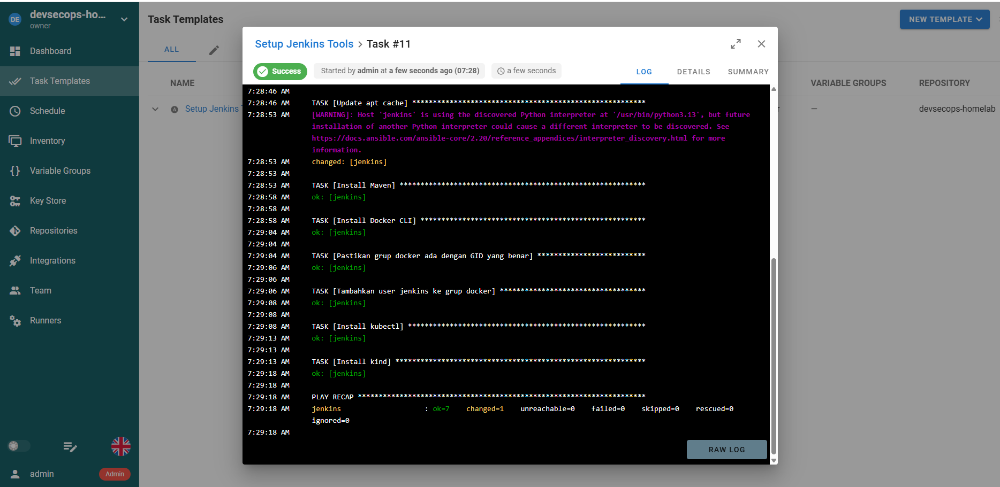

# Day 18 — Semaphore: GUI Ringan untuk Ansible

[⬅️ Day 17](../day-17-ansible-provisioning/notes.md) | [⬅️ Kembali ke index](../README.md) | [➡️ Day 19](../day-19-argocd-gitops/notes.md)

---

## ✅ Yang Dipelajari

- [x] Semaphore membungkus playbook Ansible yang sudah ada (Day 17) dengan antarmuka web — bukan pengganti
- [x] 5 komponen Semaphore: Key Store, Repository, Inventory, Environment, Task Template
- [x] Container Docker sering "kosong" — masalah yang sama seperti Jenkins (Day 16) muncul lagi: Docker CLI, GID matching
- [x] **Volume mount yang tidak lengkap** bisa membuat data "hilang" meski terlihat sudah persisten
- [x] Debugging sistematis: cek asumsi paling dasar dulu (apakah container target hidup?) sebelum menyelami detail
- [x] Perbedaan distro base image (Alpine vs Debian) mengubah command administrasi sistem yang dipakai

---

## 🧠 Konsep Kunci

| Istilah | Analogi | Penjelasan |
|---|---|---|
| **Semaphore vs Ansible CLI** | Dashboard mobil vs mesin di baliknya | Semaphore tidak mengganti logika playbook — dia cuma kasih tombol, log, dan history di atas Ansible yang sama persis |
| **Volume mount parsial** | Menyimpan draft tapi lupa simpan dokumen final | Kalau cuma sebagian folder di-mount ke volume, data yang ditulis ke folder lain tetap hilang saat container dihapus |
| **GID matching (lagi)** | Kunci dengan nomor seri yang harus sama persis | Sama seperti Day 16 — permission Docker socket dicek berdasarkan angka, bukan nama, berlaku di container manapun |
| **Debug dari lapisan paling dasar** | Cek dulu apakah listrik menyala sebelum servis alat elektronik | Banyak error rumit (`unreachable`, `permission denied`, dll) ternyata akar masalahnya sesederhana "target sedang mati" |

---

## 💻 Perjalanan Instalasi & Troubleshooting

### Masalah 1-2 — Crash `panic: unknown store type`

```bash
docker run -d --name semaphore -p 3001:3000 \
  -e SEMAPHORE_DB_DIALECT=bolt ... semaphoreui/semaphore:latest
```

**Hasil:** container crash loop terus-menerus dengan `panic: unknown store type` di modul `NewTerraformStore` — bagian kode "Pro" (fitur Terraform state store) yang tidak kita pakai sama sekali, tapi tetap dicek saat startup.

**Percobaan 1:** pin ke tag stabil `v2.18.12` — **masih crash sama**, membuktikan ini bukan soal versi mengambang (`:latest`), tapi bug di rilis itu sendiri.

### Masalah 3 — Ganti dialect + volume benar-benar bersih

```bash
docker volume rm semaphore_data
docker run -d --name semaphore -p 3001:3000 \
  -e SEMAPHORE_DB_DIALECT=sqlite ... semaphoreui/semaphore:v2.18.12
```

**Hasil:** berhasil, `Server is running`. Kesimpulan: keberhasilan ini kemungkinan besar bukan murni soal `sqlite` vs `bolt`, tapi karena volume dihapus **total** — sisa `config.json` dari percobaan gagal sebelumnya kemungkinan tidak kompatibel dengan kode "Pro" di versi ini.

### Masalah 4 — Permission Docker (pola yang sama seperti Day 16)

```
docker command not found in PATH
```

Container Semaphore berbasis **Alpine Linux** (beda dari Jenkins yang Debian) — command administrasi sistemnya beda:

```bash
docker exec -u root semaphore apk add --no-cache docker-cli
docker exec -u root semaphore sh -c "delgroup docker 2>/dev/null; addgroup -g 1001 docker"
docker exec -u root semaphore addgroup semaphore docker
```

**Insight:** `apk` (Alpine) menggantikan `apt-get` (Debian); `addgroup`/`delgroup` menggantikan `groupadd`/`groupmod` — konsep sama seperti Day 16, sintaks command berbeda karena distro berbeda.

### Masalah 5 — Login gagal & project hilang setelah restart

Setelah container di-restart untuk apply perubahan grup, muncul **`401 Unauthorized`**, lalu ternyata **project yang sudah dibuat hilang total**.

**Investigasi akar masalah:**
```bash
docker exec semaphore cat /etc/semaphore/config.json
# "sqlite": { "host": "/var/lib/semaphore/database.sqlite" }
```

Volume yang di-mount cuma `/etc/semaphore` (isi: `config.json`) — tapi database SQLite **sesungguhnya** ada di `/var/lib/semaphore/`, folder yang **tidak** ter-mount ke volume manapun. Setiap container dihapus, seluruh database (user, project, template) ikut hilang karena hidup di writable layer sementara.

**Solusi:**
```bash
docker run -d --name semaphore -p 3001:3000 \
  -v semaphore_data:/etc/semaphore \
  -v semaphore_db:/var/lib/semaphore \
  -v /var/run/docker.sock:/var/run/docker.sock \
  ... semaphoreui/semaphore:v2.18.12
```

Password direset lewat CLI dengan membuat user baru untuk memulihkan akses tanpa kehilangan data lebih lanjut:
```bash
docker exec -it semaphore semaphore user change-password --config /etc/semaphore/config.json --login admin --password ChangeMe123!
```

### Masalah 6 — Serangkaian isu kecil terakhir

**a. Docker CLI hilang lagi setelah recreate container** — karena instalasi manual sebelumnya juga tidak persisten (bukan bagian dari volume manapun), harus diinstall ulang setiap kali container benar-benar dibuat baru (bukan sekadar restart).

**b. `Failed to create temporary directory`** — Ansible gagal resolve `~` (home directory) lewat koneksi `docker exec`. Solusi: set path eksplisit di inventory:
```ini
[jenkins_servers]
jenkins ansible_connection=docker ansible_user=root ansible_remote_tmp=/tmp/.ansible-remote
```

**c. `UNREACHABLE`, folder temporary gagal dibuat** — setelah dicoba manual (`docker exec ... mkdir`), ternyata **container Jenkins yang jadi target itu sendiri sedang mati** (`is not running`). Bukan soal Ansible/Semaphore sama sekali.
```bash
docker start jenkins
```

---

## 🔬 Hasil Akhir — Playbook Berhasil Lewat GUI



```
PLAY RECAP
jenkins : ok=7    changed=1    unreachable=0    failed=0    skipped=0
```

**Insight soal `changed=1`:** task "Update apt cache" **selalu** `changed` setiap dijalankan (sifat command `apt update` yang selalu menyegarkan index paket) — bukan tanda ada yang salah. 6 task lainnya `ok` karena tools sudah terinstall dari sesi sebelumnya, konsisten dengan bukti idempotency yang sama seperti Day 17.

**Catatan soal fitur "Summary"**: tab Summary menampilkan data **demo** (server palsu seperti `web-01.prod.example.com`) yang hanya tersedia penuh di versi PRO berbayar — hasil sungguhan harus dicek di tab **LOG**, bukan Summary.

---

## 🔧 Ringkasan Troubleshooting (6 Kategori)

| # | Masalah | Akar Penyebab | Solusi |
|---|---|---|---|
| 1-2 | `panic: unknown store type` | Bug di kode "Pro" (Terraform store) versi image ini, terjadi di `:latest` maupun tag stabil `v2.18.12` | Tidak sepenuhnya "diperbaiki" oleh ganti tag — solusi sesungguhnya di kategori 3 |
| 3 | Ganti `db_dialect` ke sqlite | Sebenarnya bukan murni soal dialect — volume lama menyimpan config tidak kompatibel | Hapus volume total (`docker volume rm`), mulai bersih dengan `sqlite` |
| 4 | Permission Docker (`not found`, `denied`) | Container Alpine tidak punya Docker CLI; GID grup `docker` tidak cocok dengan host | `apk add docker-cli`, `addgroup -g <GID-host> docker` |
| 5 | Login gagal, project hilang | Volume cuma mount `/etc/semaphore`, database sesungguhnya di `/var/lib/semaphore` tidak persisten | Mount volume tambahan untuk `/var/lib/semaphore` |
| 6a | Docker CLI hilang lagi | Instalasi manual sebelumnya tidak persisten, ikut hilang saat container di-recreate | Install ulang setelah setiap recreate (idealnya: custom image) |
| 6b | `Failed to create temporary directory` | Ansible gagal resolve `~` lewat koneksi `docker exec` | Set `ansible_remote_tmp` eksplisit di inventory |
| 6c | `UNREACHABLE` | Container target (Jenkins) sedang mati, bukan soal Ansible sama sekali | `docker start jenkins` |

---

## 📌 Insight Penting

- **Masalah yang terlihat identik bisa punya akar penyebab berbeda** — error `permission denied` bisa muncul karena GID salah atau karena proses lama belum baca ulang grup baru (butuh restart); error `unreachable` bisa karena masalah konfigurasi Ansible ATAU karena target sesederhana sedang mati.
- **Volume mount harus mencakup SEMUA lokasi data penting**, bukan cuma yang "kelihatan" penting — cek dokumentasi resmi (atau `config.json` seperti yang kita lakukan) untuk tahu persis di mana data sesungguhnya disimpan.
- **Instalasi manual ke dalam container yang sedang jalan tidak pernah persisten** kecuali eksplisit di-mount sebagai volume atau di-bake ke custom image — pelajaran yang berulang dari Day 16 dan makin diperkuat di Day 18.
- **Selalu cek lapisan paling dasar duluan** ("apakah target hidup?") sebelum menyelami detail teknis yang lebih rumit — ini menghemat banyak waktu debugging dibanding langsung asumsi masalah ada di konfigurasi kompleks.
- **Distro base image mengubah tooling administrasi**, bukan cuma nama paket — penting membaca `/etc/os-release` di awal sebelum menebak-nebak command yang dipakai.
- Meski instalasinya penuh tantangan, hasil akhirnya membuktikan tujuan awal Day 18 tercapai: playbook `setup-jenkins-tools.yml` dari Day 17 kini bisa dijalankan lewat GUI dengan history dan log yang tersimpan rapi, tanpa mengubah satu baris pun playbook aslinya.

---

[⬅️ Day 17](../day-17-ansible-provisioning/notes.md) | [⬅️ Kembali ke index](../README.md) | [➡️ Day 19](../day-19-argocd-gitops/notes.md)
