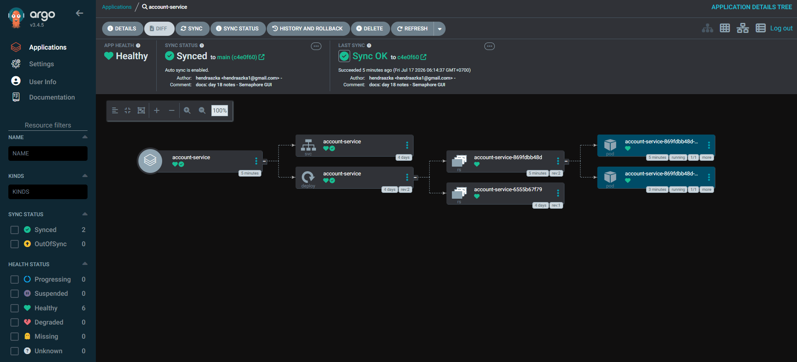

# Day 19 — ArgoCD: GitOps Penuh (Penutup Journey)

[⬅️ Day 18](../day-18-semaphore-gui/notes.md) | [⬅️ Kembali ke index](../README.md)

---

## ✅ Yang Dipelajari

- [x] GitOps membalik arah komunikasi — cluster yang aktif "menjemput" (pull) perubahan dari Git, bukan CI/CD yang "mendorong" (push) ke cluster
- [x] Kenapa ini menyelesaikan masalah jaringan yang berulang sejak Day 05, 10, dan 16
- [x] `--server-side` apply untuk mengatasi CRD besar yang melebihi batas anotasi client-side
- [x] Struktur `Application` ArgoCD: `source` (repo + path), `destination` (cluster + namespace), `syncPolicy`
- [x] **Self-healing** — pembuktian nyata bahwa ArgoCD otomatis mengembalikan perubahan manual yang menyimpang dari Git
- [x] Ini penutup resmi celah "Continuous Deployment" yang dicatat sejak Day 05

---

## 🧠 Konsep Kunci

| Istilah | Analogi | Penjelasan |
|---|---|---|
| **GitOps** | Karyawan yang cek papan pengumuman sendiri | Cluster secara aktif memeriksa Git secara berkala, bukan menunggu diperintah dari luar — membalik arah komunikasi dari push jadi pull |
| **Push-based CD (Jenkins, Day 16)** | Kurir mengantar paket ke rumah | Sistem eksternal (Jenkins) yang "mendorong" perubahan masuk ke cluster — perlu trigger manual, dan perlu akses jaringan masuk ke cluster |
| **Pull-based CD (ArgoCD)** | Penghuni rumah keluar cek kotak pos sendiri | Cluster yang aktif keluar mengecek Git — tidak perlu ada yang "masuk", cukup koneksi keluar (outbound) yang jauh lebih mudah dari sisi jaringan |
| **Self-healing** | Termostat yang otomatis menyesuaikan suhu | ArgoCD terus membandingkan kondisi nyata cluster dengan definisi di Git; kalau ada penyimpangan (disengaja atau tidak), otomatis dikembalikan |
| **`--server-side` apply** | Petugas gudang pusat yang catat sendiri, bukan titip catatan | API server Kubernetes yang mengelola kepemilikan field secara efisien, dibanding client menyimpan seluruh config sebagai anotasi (yang bisa melebihi batas ukuran untuk resource besar seperti CRD ArgoCD) |

**Kenapa ArgoCD adalah solusi paling elegan untuk celah Continuous Deployment?**
Sejak Day 05 kita tahu GitHub Actions (cloud) tidak bisa menjangkau cluster kind (lokal) karena topologi jaringan. Day 16 (Jenkins) menyelesaikan ini dengan menjalankan CD **di jaringan yang sama** dengan cluster — tapi masih butuh trigger manual. ArgoCD menyelesaikan **kedua** masalah sekaligus: dijalankan **di dalam** cluster (tidak ada masalah jaringan sama sekali) dan bekerja **otomatis** tanpa trigger apapun.

---

## 💻 Langkah 1 — Install ArgoCD

```bash
kubectl create namespace argocd
kubectl apply -n argocd -f https://raw.githubusercontent.com/argoproj/argo-cd/stable/manifests/install.yaml
```

### Masalah — CRD terlalu besar untuk client-side apply

```
The CustomResourceDefinition "applicationsets.argoproj.io" is invalid:
metadata.annotations: Too long: may not be more than 262144 bytes
```

**Penyebab:** `kubectl apply` default (client-side) menyimpan seluruh konfigurasi sebagai anotasi untuk keperluan diff di masa depan — CRD ArgoCD cukup besar sampai melebihi batas 262144 byte yang diizinkan Kubernetes untuk anotasi.

**Solusi:**
```bash
kubectl apply -n argocd -f https://raw.githubusercontent.com/argoproj/argo-cd/stable/manifests/install.yaml --server-side
```

### Warning — Conflict antar manager (aman diabaikan dalam kasus ini)

```
Apply failed with 1 conflict: conflict with "kubectl-client-side-apply"
```

**Penyebab:** percobaan pertama (client-side, gagal sebagian di tengah jalan) sempat membuat beberapa resource, lalu percobaan kedua (server-side) mencoba klaim ulang kepemilikan field yang sama.

**Verifikasi bahwa ini bukan kegagalan fungsional:**
```bash
kubectl get pods -n argocd
kubectl get crd | grep argoproj
```
Hasil: semua 7 pod `Running` dan `1/1`, ketiga CRD (`applications`, `applicationsets`, `appprojects`) terpasang dengan benar.

---

## 💻 Langkah 2 — Akses ArgoCD UI

```bash
kubectl port-forward svc/argocd-server -n argocd 8082:443
```

Ambil password admin awal (auto-generated, tersimpan sebagai Secret):
```bash
kubectl -n argocd get secret argocd-initial-admin-secret -o jsonpath="{.data.password}" | base64 -d
```

Login ke `https://localhost:8082` (browser akan warning soal self-signed certificate — aman diabaikan untuk homelab), lalu ganti password admin lewat menu **User Info** demi keamanan jangka panjang.

---

## 💻 Langkah 3 — Buat Application

`argocd-app.yaml`:
```yaml
apiVersion: argoproj.io/v1alpha1
kind: Application
metadata:
  name: account-service
  namespace: argocd
spec:
  project: default
  source:
    repoURL: https://github.com/hendraazka/devsecops-homelab.git
    targetRevision: main
    path: k8s
  destination:
    server: https://kubernetes.default.svc
    namespace: default
  syncPolicy:
    automated:
      prune: true
      selfHeal: true
    syncOptions:
      - CreateNamespace=true
```

**Insight tiap bagian:**
- `source.path: k8s` — ArgoCD memantau seluruh folder `k8s/` (mencakup `deployment.yaml` dan `service.yaml` sekaligus)
- `prune: true` — resource yang dihapus dari Git akan otomatis dihapus juga dari cluster
- `selfHeal: true` — inti fitur GitOps: penyimpangan dari kondisi Git otomatis dikoreksi

```bash
kubectl apply -f argocd-app.yaml
```

---

## 🔬 Verifikasi — Healthy & Synced



Resource tree menunjukkan hierarki lengkap: `account-service` (Application) → Service + Deployment → ReplicaSet → Pod, semuanya berstatus sehat. Detail "Last Sync" bahkan menampilkan commit terbaru beserta pesan commit-nya secara otomatis — bukti ArgoCD benar-benar memantau repo secara real-time.

---

## 🔬 Eksperimen — Pembuktian Self-Healing

### Sengaja menyimpang dari kondisi Git

```bash
kubectl scale deployment account-service --replicas=5
kubectl get pods
```

**Hasil sesaat:** 5 pod muncul (3 baru dalam status `ContainerCreating`/`0/1`) — perubahan manual sempat berhasil.

### Tunggu, cek lagi

```bash
kubectl get pods
```

**Hasil setelah ~30-60 detik:**
```
NAME                               READY   STATUS    RESTARTS   AGE
account-service-869fdbb48d-5w6fc   1/1     Running   0          12m
account-service-869fdbb48d-7jw59   1/1     Running   0          10m
```

**Kembali ke 2 pod secara otomatis** — sesuai `replicas: 2` yang didefinisikan di `k8s/deployment.yaml` di Git. Tidak ada `kubectl scale` manual dijalankan untuk mengembalikannya — ArgoCD yang melakukannya sendiri.

---

## 🔧 Ringkasan Troubleshooting

| Masalah | Penyebab | Solusi |
|---|---|---|
| CRD `applicationsets.argoproj.io` invalid, anotasi terlalu besar | Client-side apply menyimpan seluruh config sebagai anotasi, melebihi batas 262144 byte | Gunakan `--server-side` |
| Warning conflict antar field manager | Percobaan client-side yang gagal sebagian sempat membuat resource sebelum percobaan server-side | Verifikasi manual (`kubectl get pods/crd`) — bukan kegagalan fungsional dalam kasus ini |

---

## 📌 Insight Penting — Refleksi Akhir Seluruh Journey (Day 01-19)

- **GitOps menutup celah arsitektural, bukan cuma menambah fitur** — masalah topologi jaringan yang terus muncul sejak Day 05 (GitHub Actions tidak bisa akses cluster lokal) akhirnya terselesaikan bukan dengan "workaround", tapi dengan membalik total arah komunikasinya.
- **Self-healing adalah bukti nyata "declarative" vs "imperative"** — sepanjang journey ini kita berulang kali pakai perintah imperatif (`kubectl apply`, `kubectl set image`), tapi ArgoCD menunjukkan kekuatan penuh pendekatan deklaratif: kamu cukup bilang "kondisi yang saya inginkan begini", dan sistem yang terus-menerus menjaganya, bahkan melawan intervensi manual.
- **Evolusi solusi CD sepanjang journey ini mencerminkan pembelajaran nyata**: Day 05 (temukan masalah) → Day 10 (pahami akar masalah jaringan) → Day 16 (push-based, butuh trigger manual, tapi bekerja) → Day 19 (pull-based, otomatis penuh, tanpa trigger). Setiap tahap membangun pemahaman yang lebih dalam, bukan langsung lompat ke solusi "sempurna".
- Setelah 19 hari, portofolio ini mencakup: fondasi DevOps lengkap, 7 gate keamanan otomatis, 2 lapis admission control, IaC security scanning, perbandingan 2 tools SAST, 2 platform CI/CD berbeda dengan filosofi berlawanan (push vs pull), provisioning otomatis dengan pembuktian idempotency, dan penutup GitOps yang benar-benar berfungsi — sebuah perjalanan belajar yang koheren, bukan sekadar kumpulan tutorial terpisah.

---

[⬅️ Day 18](../day-18-semaphore-gui/notes.md) | [⬅️ Kembali ke index](../README.md)
